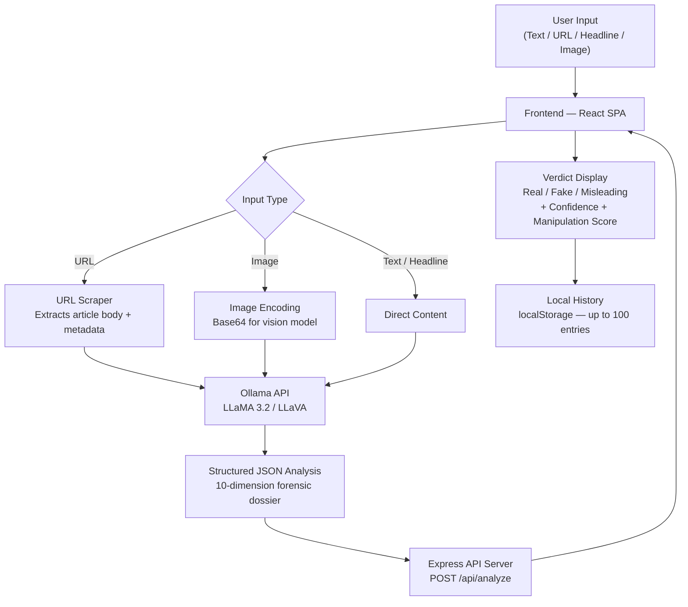

# 🛡️ SatyaCheck — Fake News Detection & Verification System

> **सत्य** (*Satya*) means **Truth** in Sanskrit.
> *Verify News. Build a More Informed World.*

[](https://react.dev)
[](https://vitejs.dev)
[](https://tailwindcss.com)
[](https://developer.mozilla.org/en-US/docs/Web/JavaScript)
[](LICENSE)

---

## 🚨 The Problem

We live in an age where a fabricated headline can circle the globe before a correction is published. Fake news spreads **6× faster** than real news on social media (MIT, 2018). 59% of shared links are never even read past the headline. The scale of digital misinformation threatens public health decisions, election integrity, and social cohesion.

Most people lack the tools, time, or training to verify information on the fly. SatyaCheck was built to close that gap.

---

## 💡 Our Solution

SatyaCheck is a full-stack AI-powered fact-checking platform that lets anyone — journalist, student, or everyday user — submit content and receive a structured forensic verdict in seconds.

**How it works:**

1. **Submit** — paste text, a URL, a headline, or upload an image/screenshot
2. **Analyze** — a local AI model (Ollama / LLaMA) performs deep multi-dimensional forensic analysis
3. **Verdict** — receive a structured dossier: `Real`, `Fake`, or `Misleading`, with a confidence score, manipulation index, rhetorical tactics detected, logical fallacies, fact breakdown by dimension, and source references

Beyond single checks, SatyaCheck includes a full media literacy ecosystem: a WhatsApp/Telegram Forward Analyzer, Source Credibility Index, Streaming AI Chat, Verification Dashboard, Trending Misinformation Wire, and a Daily Fact-Checking Quiz.

---

## ✨ Key Features

### 🔍 Core Analysis Engine
- **Multi-format input**: text, article URL (with auto-scraping), headline, or image/screenshot
- **10-dimension fact breakdown**: each claim rated `real`, `fake`, `misleading`, or `unverified`
- **Manipulation score** (0–100): quantifies rhetorical aggression
- **Emotional tactics detection**: fear appeals, outrage bait, us-vs-them framing, cherry picking, and more
- **Logical fallacy identification**: ad hominem, straw man, false dichotomy, slippery slope, etc.
- **Headline vs. content consistency check**
- **Author/source credibility assessment**
- **Additional source references** for independent cross-checking
- **Voice input** via Web Speech API (microphone dictation)
- **Keyboard shortcut** `Ctrl+Enter` to submit instantly
- **Confetti animation** on `Real` verdicts

### 📋 Forward Analyzer
- Paste forwarded WhatsApp or Telegram messages
- Strips forwarding noise and metadata
- Detects manipulation signals in chain-forwarded content

### 🌐 Source Credibility Index
- Submit any domain URL for a trust score
- Rates source credibility with contextual reasoning

### 💬 AI Research Assistant (Chat)
- Streaming server-sent events (SSE) chat interface
- Ask follow-up questions about misinformation, media bias, or fact-checking methodology
- Quick-prompt suggestions for common research tasks

### 📊 Verification Dashboard
- Aggregated platform statistics: total checks, real/fake/misleading breakdown
- Interactive pie chart and bar chart (Recharts)
- Tabular verification history with timestamps and verdict badges

### 🗂️ Personal History
- Every check you run is saved **locally in your browser** (localStorage)
- Search and filter by verdict (`Real`, `Fake`, `Misleading`)
- Export your complete history as a CSV file
- Up to 100 entries retained, individually removable

### 📰 Misinformation Wire
- Live feed of trending misinformation stories
- Filter by category and topic

### 🧠 Daily Quiz
- Interactive daily quiz to build fact-checking literacy
- Tests real-world media literacy skills

### 📚 Media Literacy Hub
- Educational guides on identifying fake news, analyzing emotional tone, verifying images, and responsible sharing
- Explains the spectrum: Misinformation, Disinformation, and Malinformation
- Sourced statistics from MIT, Columbia University, and the Senate Intelligence Committee

### 🎨 Design & UX
- Dark / Light mode with persistent preference (localStorage)
- Responsive layout — works on desktop, tablet, and mobile
- Animated transitions via Framer Motion
- Clean editorial aesthetic — intentional typography, restrained color palette
- SatyaCheck brand identity with custom logo and favicon

---

## 🧠 How SatyaCheck Works



The frontend is a pure client-side React SPA that communicates with a local Express API server. The backend uses Ollama to run a local LLM (LLaMA 3.2 for text, LLaVA for image vision) to perform forensic analysis. No content is sent to external cloud APIs — all inference is **local and private**.

---

## 🤖 AI & Verification Technology

| Component | Technology | Purpose |
|---|---|---|
| **Text Analysis** | Ollama + LLaMA 3.2 | Multi-dimensional forensic fact-checking |
| **Image Analysis** | Ollama + LLaVA (vision) | Visual manipulation detection in images/screenshots |
| **URL Scraping** | Custom scraper (Node.js) | Extracts article body, title, author, publish date |
| **Chat** | Ollama (streaming SSE) | Real-time conversational fact-checking assistant |
| **Credibility** | Ollama | Domain/source trust scoring |

> **Privacy note:** All AI inference runs locally via Ollama. Your submitted content is never sent to any third-party cloud service.

---

## 🏗️ Technology Stack

### Frontend

| Technology | Version | Role |
|---|---|---|
| React | 19 | UI component library |
| Vite | 7 | Build tool and dev server |
| Tailwind CSS | 4 | Utility-first styling |
| JavaScript (ES2022) | — | Language (no TypeScript) |
| wouter | 3 | Lightweight client-side routing |
| @tanstack/react-query | 5 | Server state management + caching |
| shadcn/ui (Radix UI) | — | Accessible headless UI components |
| Framer Motion | 12 | Animations and transitions |
| Recharts | 2 | Dashboard charts (pie, bar) |
| Lucide React | — | Icon library |
| canvas-confetti | — | Confetti animation on Real verdicts |
| date-fns | 3 | Date formatting |

### Backend (separate service)

| Technology | Role |
|---|---|
| Node.js + Express | REST API server |
| Ollama | Local LLM runtime |
| LLaMA 3.2 | Text fact-checking model |
| LLaVA | Vision model for image analysis |
| Drizzle ORM + SQLite | Persistent analysis storage |

---

## 📂 Project Structure

```
frontend-js/
├── public/
│   ├── logo-horizontal.png      # Light mode navbar logo
│   ├── logo-horizontal-dark.png # Dark mode navbar logo
│   ├── logo-mark.png            # Standalone brand icon
│   ├── logo-full.png            # Full logo with tagline
│   ├── favicon.svg / .png       # Browser favicon
│   └── apple-touch-icon.png     # iOS icon
│
├── src/
│   ├── components/
│   │   ├── layout/
│   │   │   ├── Navbar.jsx       # Top navigation bar
│   │   │   └── Footer.jsx       # Site footer
│   │   └── ui/                  # shadcn/ui components (Button, Card, etc.)
│   │
│   ├── hooks/
│   │   ├── use-analysis.js      # API integration (React Query)
│   │   ├── use-voice-input.js   # Web Speech API (microphone)
│   │   ├── use-theme.js         # Dark/light mode toggle
│   │   └── use-toast.js         # Toast notification state
│   │
│   ├── lib/
│   │   └── utils.js             # Utility functions (cn, etc.)
│   │
│   ├── pages/
│   │   ├── Home.jsx             # Landing page
│   │   ├── Detect.jsx           # Main analysis interface
│   │   ├── Chat.jsx             # AI research assistant
│   │   ├── Dashboard.jsx        # Statistics dashboard
│   │   ├── History.jsx          # Personal verification history
│   │   ├── Forward.jsx          # WhatsApp/Telegram forward checker
│   │   ├── Credibility.jsx      # Source trust scoring
│   │   ├── Trending.jsx         # Misinformation wire
│   │   ├── Quiz.jsx             # Daily fact-checking quiz
│   │   ├── Education.jsx        # Media literacy hub
│   │   ├── About.jsx            # About SatyaCheck
│   │   └── not-found.jsx        # 404 page
│   │
│   ├── App.jsx                  # Router and layout shell
│   ├── main.jsx                 # React entry point
│   └── index.css                # Design system (Tailwind + tokens)
│
├── index.html                   # HTML entry point
├── vite.config.js               # Vite + Tailwind config
├── jsconfig.json                # Path aliases
├── package.json                 # Dependencies
└── .gitignore
```

---

## 🚀 Getting Started

### Prerequisites

- **Node.js** v18 or later — [nodejs.org](https://nodejs.org)
- **Ollama** — [ollama.com](https://ollama.com) (required for AI analysis)
- **Git** — [git-scm.com](https://git-scm.com)

### 1. Clone the Repository

```bash
git clone https://github.com/shivamrana200526-beep/Fake-News-Detection-System.git
cd Fake-News-Detection-System
```

### 2. Install Ollama Models

```bash
# Pull the main text analysis model
ollama pull llama3.2

# Pull the vision model for image analysis (optional but recommended)
ollama pull llava
```

Make sure Ollama is running before starting the backend:

```bash
ollama serve
```

### 3. Install Frontend Dependencies

```bash
npm install
```

### 4. Start the Backend API Server

> The backend server lives in the `api-server/` directory of the parent repository. Start it separately on port `3000`.

```bash
# From the api-server directory:
npm install
npm run dev
```

The backend API will be available at `http://127.0.0.1:3000`.

### 5. Start the Frontend Dev Server

```bash
npm run dev
```

Open [http://localhost:5173](http://localhost:5173) in your browser.

---

## 📦 Build for Production

```bash
npm run build
```

Production-ready static files will be output to `dist/`. Preview locally with:

```bash
npm run preview
```

---

## 🛣️ Routes

| Path | Page | Description |
|---|---|---|
| `/` | Home | Landing page with platform overview |
| `/detect` | Detect | Main fact-checking interface |
| `/chat` | Chat | Streaming AI research assistant |
| `/dashboard` | Dashboard | Platform statistics and charts |
| `/history` | History | Personal browser-local check history |
| `/forward` | Forward Analyzer | WhatsApp/Telegram message checker |
| `/credibility` | Credibility | Source domain trust scoring |
| `/trending` | Trending | Live misinformation wire |
| `/quiz` | Quiz | Daily fact-checking quiz |
| `/education` | Education | Media literacy hub |
| `/about` | About | Mission and methodology |

---

## 🌍 UN SDG Alignment

SatyaCheck aligns with four United Nations Sustainable Development Goals:

| SDG | Goal | How SatyaCheck Contributes |
|---|---|---|
| **SDG 4** | Quality Education | Promotes media literacy and critical thinking through the Education hub and Daily Quiz |
| **SDG 9** | Industry & Innovation | Builds resilient AI infrastructure for information integrity |
| **SDG 10** | Reduced Inequalities | Democratizes access to forensic fact-checking tools for all users |
| **SDG 16** | Peace & Justice | Supports transparent, strong institutions by combating disinformation |

---

## 🤝 Contributing

Contributions, issues, and feature requests are welcome.

1. Fork the repository
2. Create your feature branch: `git checkout -b feature/your-feature`
3. Commit your changes: `git commit -m 'Add your feature'`
4. Push to the branch: `git push origin feature/your-feature`
5. Open a Pull Request

Please ensure your code follows the existing style and that no API keys, secrets, or credentials are included in commits.

---

## 📄 License

This project is licensed under the **MIT License**. See [LICENSE](LICENSE) for details.

---

## 👤 Author

**Shivam Rana**
GitHub: [@shivamrana200526-beep](https://github.com/shivamrana200526-beep)

---

<div align="center">
  <sub>Built with ❤️ to defend truth in the digital age.</sub><br/>
  <sub><em>Satya (सत्य) — Truth</em></sub>
</div>
