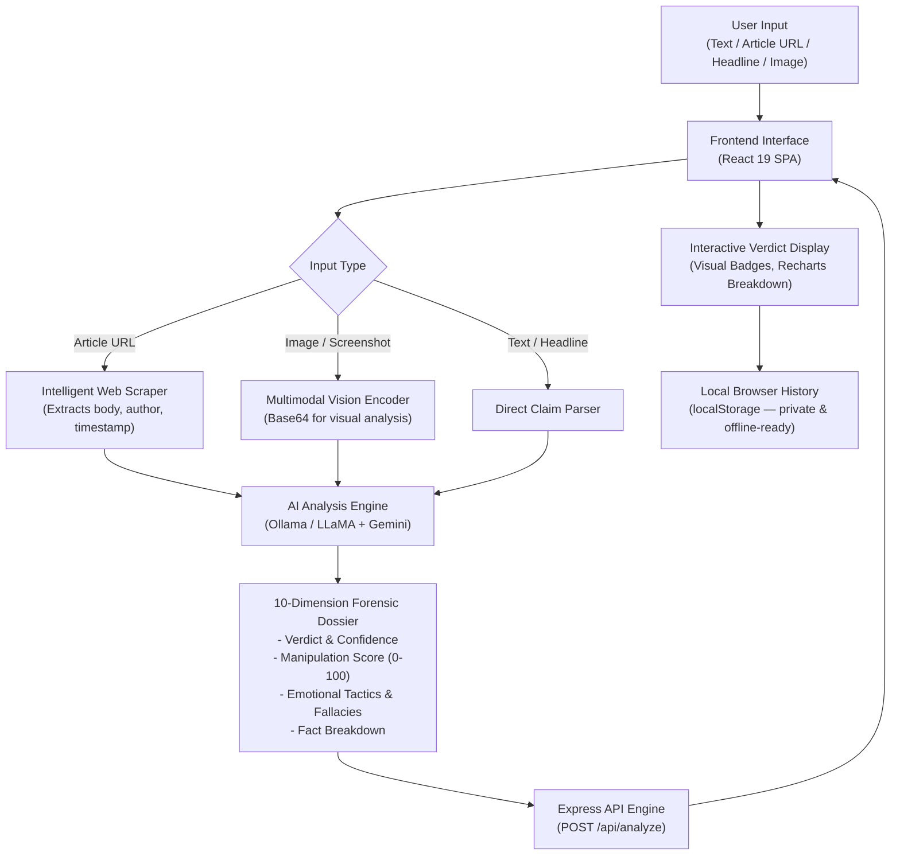

# 🛡️ SatyaCheck — Fake News Detection & Verification System

> **सत्य** (*Satya*) means **Truth** in Sanskrit.  
> *Verify News. Defend Truth. Build a More Informed World.*

[](https://github.com/shivamrana200526-beep/Fake-News-Detection-System/actions/workflows/ci.yml)
[](src/__tests__)
[](https://react.dev)
[](https://vitejs.dev)
[](https://tailwindcss.com)
[](https://developer.mozilla.org/en-US/docs/Web/JavaScript)
[](LICENSE)
[](CONTRIBUTING.md)

---

## 🚨 The Problem

We live in an age where a fabricated headline can circle the globe before a correction is published. Fake news spreads **6× faster** than verified news on social media (MIT, 2018), and over **59% of shared links** are never read past the headline. Digital misinformation undermines public health, election integrity, and civic trust.

Most individuals lack the forensic tools or training to verify viral content in real time. **SatyaCheck** was engineered to solve this crisis.

---

## 💡 Our Solution

SatyaCheck is an open-source, full-stack, multimodal verification system. Anyone — students, journalists, researchers, or everyday citizens — can submit content and receive an objective, structured **10-dimension forensic dossier** in seconds.

### The Verification Workflow



---

## 📖 Comprehensive Usage Guide

SatyaCheck supports 4 distinct verification modes designed for everyday media consumption:

### 1. Raw Text & Viral Claims Mode
* **When to use:** Short viral messages, statements, or quotes heard offline or online.
* **How to use:**
  1. Navigate to the **Detect** page (`/detect`).
  2. Select the **Text** tab.
  3. Paste the statement (e.g., *"NASA confirmed that the earth is completely flat in their latest press release"*).
  4. Click **Verify Claim** or press <kbd>Ctrl</kbd> + <kbd>Enter</kbd> (<kbd>Cmd</kbd> + <kbd>Enter</kbd> on macOS).
  5. SatyaCheck returns an instant verdict with evidence breakdown.

### 2. Article URL Verification Mode
* **When to use:** Web news links, blogs, or suspicious URLs.
* **How to use:**
  1. Select the **URL** tab on `/detect`.
  2. Paste the full link (e.g., `https://example-news.org/article-123`).
  3. SatyaCheck's automated scraper extracts the article headline, author, publishing date, and article body, filtering out ads and navigational boilerplate before forensic analysis.

### 3. Headline Cross-Check Mode
* **When to use:** Clickbait headlines where the article text doesn't match the title.
* **How to use:**
  1. Select the **Headline** tab on `/detect`.
  2. Enter the title. SatyaCheck specifically diagnoses headline-to-reality divergence, sensationalism index, and misleading omissions.

### 4. Image & Screenshot Verification Mode
* **When to use:** Screenshots of viral tweets, forged WhatsApp forward images, or doctored infographics.
* **How to use:**
  1. Select the **Image** tab on `/detect`.
  2. Drag and drop or browse for any `.png`, `.jpg`, or `.webp` file.
  3. The multimodal vision pipeline inspects visual typography, layout anomalies, and OCR claim extraction.

---

### 📊 Understanding Your Forensic Dossier

Every verified submission provides a structured, 10-dimension forensic assessment:

| Dimension | Description | Example Output |
|---|---|---|
| **Primary Verdict** | Clear classification label | `VERIFIED REAL`, `IDENTIFIED FAKE`, `MISLEADING CONTEXT` |
| **Confidence Score** | Statistical model confidence (0–100%) | `95% Confidence` |
| **Manipulation Index** | Intensity of manipulative rhetoric | `10/100` (Low) vs `85/100` (Extreme) |
| **Emotional Tactics** | Psychological triggers detected | `Fear appeal`, `False urgency`, `Outrage bait` |
| **Logical Fallacies** | Faulty argumentation patterns | `Ad hominem`, `False dichotomy`, `Straw man` |
| **Fact Itemization** | Granular observation breakdown | 3 to 6 verified facts with source attribution |
| **Headline Consistency**| Whether the title reflects reality | `True`, `False`, or `Discrepant` |
| **Primary Sources** | Verified citation links | Direct cross-reference links for manual inspection |

---

### 💬 Additional Tools in the Suite

* **Forward Analyzer (`/forward`):** Paste long chain forwards from WhatsApp or Telegram; SatyaCheck cleans forwarding noise and highlights manipulation patterns.
* **Source Credibility Index (`/credibility`):** Check any publisher's domain name (e.g. `bbc.com` or `theonion.com`) for journalistic reliability, transparency, and bias ratings.
* **AI Research Assistant (`/chat`):** Streaming real-time conversation via Server-Sent Events (SSE) to ask follow-up questions and investigate media bias.
* **Media Literacy Hub (`/education`):** Comprehensive educational guides explaining Misinformation, Disinformation, and Malinformation.
* **Daily Quiz (`/quiz`):** 10-question daily literacy test to build fact-checking intuition.
* **CSV Export (`/history`):** Download your complete personal verification history with one click for research, school, or documentation.

---

## 🤖 AI & Verification Architecture

| Engine | Model | Role |
|---|---|---|
| **Primary Text Engine** | `llama3.2:1b` / `llama3.2` | High-speed multi-dimensional forensic analysis |
| **Multimodal Vision Engine**| `llava` | Visual manipulation and screenshot verification |
| **Validation Engine** | Google Gemini | Independent cross-referencing and secondary verdict validation |
| **Live Assistant** | Streaming SSE | Token-by-token interactive research assistant |

---

## 🏗️ Technology Stack

### Frontend Application
* **React 19**: Component architecture with modern hooks
* **Vite 7**: Ultra-fast module bundler and development server
* **Tailwind CSS 4**: Modern CSS token design system with dark/light theme persistence
* **Pure JavaScript (ES2024)**: Clean, accessible code with 0% TypeScript overhead
* **Radix UI & shadcn/ui**: Accessible, keyboard-navigable headless primitives
* **Recharts 2**: Responsive visualization graphs (pie & bar charts)
* **Framer Motion 12**: Micro-interactions and smooth page transitions
* **Vitest 3**: High-performance unit and integration testing suite

### Backend API
* **Node.js & Express 5**: Native ES Modules REST API
* **Ollama**: Local, private LLM execution runtime (zero telemetry)
* **Drizzle ORM**: PostgreSQL database schemas and migrations
* **Local Fallback Engine**: Automatic JSON file persistence when database server is offline

---

## 📂 Repository Organization

```
Fake-News-Detection-System/
├── .github/
│   ├── workflows/
│   │   └── ci.yml               # GitHub Actions CI (Build & Test pipeline)
│   ├── ISSUE_TEMPLATE/
│   │   ├── bug_report.md        # Standardized bug reporting
│   │   └── feature_request.md   # Feature suggestion template
│   └── pull_request_template.md # PR quality checklist
│
├── public/                      # Official brand assets (logos, icons, favicons)
│   ├── logo-horizontal.png      # Light mode navbar brand
│   ├── logo-horizontal-dark.png # Dark mode navbar brand
│   └── favicon.svg              # Browser tab icon
│
├── src/
│   ├── __tests__/               # Automated unit & integration tests
│   │   ├── utils.test.js        # Tailwind & class merge tests
│   │   ├── verdict.test.js      # Scoring & chart calculation tests
│   │   └── storage.test.js      # LocalStorage & CSV generation tests
│   │
│   ├── components/              # Modular UI components
│   │   ├── layout/              # Navbar, Footer, and responsive drawer
│   │   └── ui/                  # Accessible buttons, dialogs, cards
│   │
│   ├── hooks/                   # React Query, theme, voice input hooks
│   ├── lib/                     # Client utilities and helpers
│   ├── pages/                   # Application views (11 routes)
│   ├── App.jsx                  # Main application router
│   └── main.jsx                 # Client entrypoint
│
├── .editorconfig                # Universal indentation and formatting rules
├── CONTRIBUTING.md              # Community contribution guidelines
├── CODE_OF_CONDUCT.md           # Contributor Covenant Code of Conduct
├── SECURITY.md                  # Security vulnerability reporting policy
├── LICENSE                      # Open-source MIT License
├── package.json                 # Metadata, dependencies, and test scripts
└── vite.config.js               # Vite bundler configuration
```

---

## 🚀 Quickstart & Installation

### Prerequisites
* **Node.js** (v18.0 or newer) — [nodejs.org](https://nodejs.org)
* **Git** — [git-scm.com](https://git-scm.com)
* **Ollama** — [ollama.com](https://ollama.com) *(Required for local AI inference)*

### 1. Clone the Repository
```bash
git clone https://github.com/shivamrana200526-beep/Fake-News-Detection-System.git
cd Fake-News-Detection-System
```

### 2. Install Dependencies
```bash
npm install
```

### 3. Download AI Model
```bash
# Pull the ultra-fast 1B model (recommended for CPU laptops):
ollama pull llama3.2:1b

# Start the Ollama local daemon:
ollama serve
```

### 4. Run the Development Server
```bash
npm run dev
```
Open **[http://localhost:5173](http://localhost:5173)** in your browser!

---

## 🧪 Running Automated Tests

SatyaCheck includes a comprehensive Vitest test suite covering utility functions, verdict logic, manipulation scoring thresholds, storage bounds, and CSV generation:

```bash
# Run tests once:
npm test

# Run tests in interactive watch mode:
npm run test:watch
```

---

## 📦 Production Build

```bash
npm run build
```
The optimized production bundle will be generated in `dist/`. Preview it locally:
```bash
npm run preview
```

---

## 🌍 UN Sustainable Development Goals (SDG) Alignment

SatyaCheck is proud to contribute toward four United Nations Global Goals:

* **SDG 4 (Quality Education):** Equipping the public with critical thinking tools and media literacy resources.
* **SDG 9 (Industry, Innovation & Infrastructure):** Advancing open-source, ethical artificial intelligence for content integrity.
* **SDG 10 (Reduced Inequalities):** Democratizing access to enterprise-grade fact-checking tools without paywalls.
* **SDG 16 (Peace, Justice & Strong Institutions):** Protecting democratic discourse and public decision-making from coordinated disinformation campaigns.

---

## 🤝 Community & Contributing

We welcome contributions from developers, researchers, and fact-checkers worldwide!
* Read our [Contribution Guide](CONTRIBUTING.md) to set up your environment.
* Review our [Code of Conduct](CODE_OF_CONDUCT.md).
* Report security concerns following our [Security Policy](SECURITY.md).

---

## 📄 License

This project is licensed under the **MIT License**. See the [LICENSE](LICENSE) file for complete details.

---

## 👤 Author

**Shivam Rana**  
GitHub: [@shivamrana200526-beep](https://github.com/shivamrana200526-beep)

<div align="center">
  <sub>Built with ❤️ to defend truth in the digital age.</sub><br/>
  <sub><em>Satya (सत्य) — Truth</em></sub>
</div>
